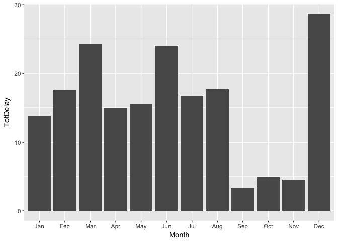
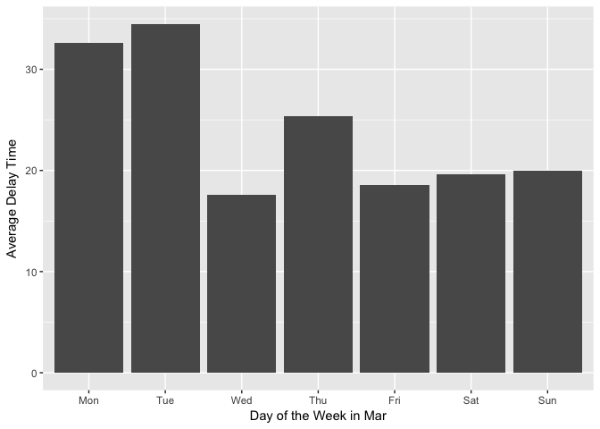
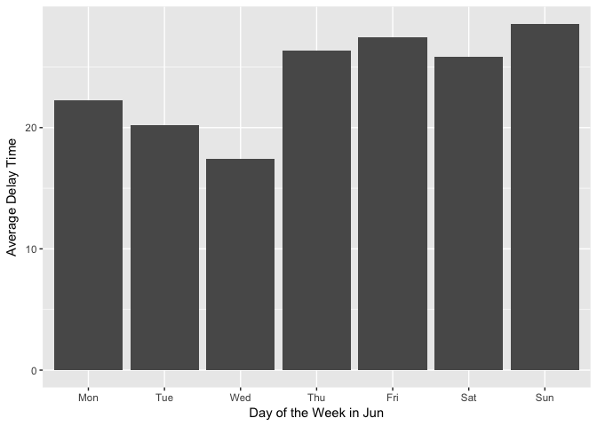
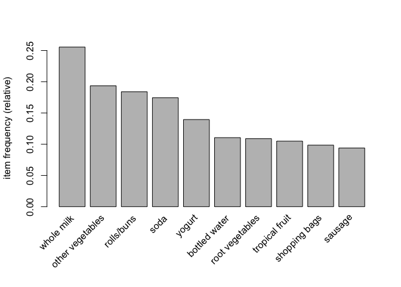

STA 380 Homework2
================
Boying You, Daxi Cheng, Jianjie Zheng, Lufang Liu, Yixuan Du

This is the homework 2 for the second part of STA380 in Red McCombs business school.

Question 1 Flights at ABIA
==========================

### Goal: Our team decided to answer the following question: when is the best time in a year to fly from Austin to other cities?

### Data cleaning

``` r
library(ggplot2)
ABIA = read.csv("~/downloads/ABIA.csv")
```

As a first step, we did a four-step data cleaning： dropped all the missing values in *ArrDelay* and *DepDelay*, converted all months and day of week numbers into factors with names, selected only filghts originated from Austin, and lastly summed the departure delay time and the arrival delay time together to become the total delay time.

``` r
# We dropped missing values and converted months and days into factors with month and day of week names. We only kept flights originated from Austin.

ABIA_cleaned = ABIA[!is.na(ABIA$ArrDelay),][!is.na(ABIA$DepDelay),][ABIA$Origin=='AUS',]
ABIA_cleaned$Month<-factor(ABIA_cleaned$Month,levels=c(1,2,3,4,5,6,7,8,9,10,11,12),labels=c("Jan","Feb","Mar","Apr","May","Jun","Jul","Aug","Sep","Oct","Nov","Dec"))
ABIA_cleaned$DayOfWeek<-factor(ABIA_cleaned$DayOfWeek,levels=c(1,2,3,4,5,6,7),labels=c("Mon","Tue","Wed","Thu","Fri","Sat","Sun"))

# For these remaining flights, we summed the departure and arrival delay times together to get the total delay time. We believe the total delay time is the one which travelers care the most.

ABIA_cleaned$TotDelay=ABIA_cleaned$ArrDelay+ABIA_cleaned$DepDelay
```

### Analysis by month

We computed and plotted the average total delay time in each month

``` r
month_delay=ABIA_cleaned[,c('Month','TotDelay','DayOfWeek')]
month_avg_delay = aggregate(.~Month, data=month_delay, mean, na.rm=TRUE, na.action=NULL)
ggplot(data = month_avg_delay,mapping = aes(x= Month, y= TotDelay )) + geom_col()
```



As can be seen from the graphs above, March, June, and December are three months with highest average total delay time. We would recommend you to avoid travelling in these months if possible.

### Analysis by the day of week in each month

However, we understand that it is often inconvenient to make such dramatic change to your travel plan. Our team wanted to know if it is possible to change the day of the week to travel in those months with highest average total delay time. So we did a further analysis on average delay time in those three months based on different days of a week.

``` r
new = aggregate(month_delay$TotDelay, by=list(Month=month_delay$Month, DayOfWeek=month_delay$DayOfWeek), FUN=mean)

list= c("Mar","Jun","Dec")

par(mfrow=c(1,3))
for (i in 1:length(list)){
  mon=new[which(new[,1]==list[i]),]
  monthstr=list[i]
  xlab=paste('Day of the Week in',monthstr)
  print(ggplot(data = mon,mapping = aes(x= DayOfWeek, y= x))+geom_col()+labs(x=xlab, y='Average Delay Time'))
  
}
```



As can be seen from the plots above, a good choice is to travel on Wednesday since it has the lowest average delay time in a week.

### Analysis by distance

My team also wanted to test if there is a difference between short and long distance flights across all 12 months.It is commonly known that it is easier for long distance (more than 750 miles) flights to re-accommodate their time by changing their speed. This kind of re-accommodating may require certain traffic and weather conditions that are related to month.

``` r
LongFlight=ABIA_cleaned[which(ABIA_cleaned$Distance>=750),c('Month','TotDelay','DayOfWeek')]
ShortFlight=ABIA_cleaned[which(ABIA_cleaned$Distance<750),c('Month','TotDelay','DayOfWeek')]


LongFlight_month = aggregate(.~Month, data=LongFlight, mean, na.rm=TRUE, na.action=NULL)
ShortFlight_month = aggregate(.~Month, data=ShortFlight, mean, na.rm=TRUE, na.action=NULL)

LongFlight_month$LongFlightSave=LongFlight_month$TotDelay-ShortFlight_month$TotDelay

LongFlight_month[which(LongFlight_month$LongFlightSave>=0),c(1,4)]
```

    ##    Month LongFlightSave
    ## 1    Jan     8.40689489
    ## 2    Feb     4.13520322
    ## 4    Apr     2.66006978
    ## 6    Jun     6.32394161
    ## 7    Jul     8.29463168
    ## 8    Aug     2.39986663
    ## 9    Sep     0.07839575
    ## 11   Nov     1.66358393
    ## 12   Dec     5.85167697

So for the months listed above, we recommend taking a long distance trip in order to minimize the delay. As for the rest of the year, a short distance trip would be better.

### Conclusion

Given the analysis above, our team offer these suggestions to the travelers in Austin:

-   If possible, schedule your trip in September, October and December to avoid the heavy traffic and long delay time.

-   If you have to travel among those months, Wednesday would be recommended for the sake of attaining relatively lower delay time.

-   One additional suggestion: March, May, and October are the ideal months for short trips, and also, the rest months of the year are ideal months for longer trips.

Question 2 Author attribution
=============================

For this question, we decided to pick Naive Bayes and Random Forest methods because they are considered as common ways to deal with text mining problems. After we performed these methods, we would compare them using prediction accuracies in the test data. Our goal in this question is to perform these two methods and use a better method to predict the author names given in the testing data.

### Naive Bayes method

``` r
library(tm)
```

We defined a function called readerPlain to read the content of text files.

``` r
readerPlain = function(fname){
  readPlain(elem=list(content=readLines(fname)),id=fname, language='en') }
```

At first, we loaded the training and testing directory.

``` r
train_dirs = Sys.glob("~/downloads/STA380-master/data/ReutersC50/C50train/*")
test_dirs = Sys.glob("~/downloads/STA380-master/data/ReutersC50/C50test/*")
```

#### The Sparse matrix

For training set

``` r
file_list_train = NULL
labels_train = NULL
y_train = NULL
for(author in train_dirs) {
  author_name = tail(strsplit(author,split="/")[[1]],1)
  files_to_add = Sys.glob(paste0(author, '/*.txt'))
  file_list_train = append(file_list_train, files_to_add)
  labels_train = append(labels_train, rep(author_name, length(files_to_add)))
}
```

By using the for loop here, we got the author name for each txt files in the training data set and also the file path toward each text files for each author in the training set.

We then combined all the text files in the training set and made it into corpus by using Corpus() function.

``` r
train_docs = lapply(file_list_train, readerPlain) 
names(train_docs) = file_list_train
names(train_docs) = sub('.txt', '', names(train_docs))
my_corpus_train = Corpus(VectorSource(train_docs))
```

For the testing set, we repeated what we did for the training set and made a corpus for the testing data.

``` r
file_list_test = NULL
labels_test = NULL
for(author in test_dirs) {
  author_name = tail(strsplit(author,split="/")[[1]],1)
  files_to_add = Sys.glob(paste0(author, '/*.txt'))
  file_list_test = append(file_list_test, files_to_add)
  labels_test = append(labels_test, rep(author_name, length(files_to_add)))
}

test_docs = lapply(file_list_test, readerPlain) 
names(test_docs) = file_list_test
names(test_docs) = sub('.txt', '', names(test_docs))
my_corpus_test = Corpus(VectorSource(test_docs))
```

#### Data Preprocessing

For train data

``` r
my_corpus_train = tm_map(my_corpus_train, content_transformer(tolower)) 
# make everything lowercase
my_corpus_train = tm_map(my_corpus_train, content_transformer(removeNumbers)) 
# remove numbers
my_corpus_train = tm_map(my_corpus_train, content_transformer(removePunctuation)) 
# remove punctuation
my_corpus_train = tm_map(my_corpus_train, content_transformer(stripWhitespace)) 
# remove excess white-space
my_corpus_train = tm_map(my_corpus_train, content_transformer(removeWords), stopwords("SMART"))
```

After we removed numbers, punctuations, excess white-spaces and stopwords, we got our new corpus for the training set.

``` r
# for test data
my_corpus_test = tm_map(my_corpus_test, content_transformer(tolower)) # make everything lowercase
my_corpus_test = tm_map(my_corpus_test, content_transformer(removeNumbers)) # remove numbers
my_corpus_test = tm_map(my_corpus_test, content_transformer(removePunctuation)) # remove punctuation
my_corpus_test = tm_map(my_corpus_test, content_transformer(stripWhitespace)) ## remove excess white-space
my_corpus_test = tm_map(my_corpus_test, content_transformer(removeWords), stopwords("SMART"))
```

#### Model Prediction and Accuracy

``` r
library('naivebayes')
```

Then We made our training and testing corpus into document term matrices.

``` r
DTM_train = DocumentTermMatrix(my_corpus_train)
DTM_test = DocumentTermMatrix(my_corpus_test)
```

By using class functions, we finally got our sparse matrix for the training and testing sets. In addition, inspect function were used here to get access to the values inside of the sparse matrix.

``` r
class(DTM_train)  
```

    ## [1] "DocumentTermMatrix"    "simple_triplet_matrix"

``` r
class(DTM_test)
```

    ## [1] "DocumentTermMatrix"    "simple_triplet_matrix"

``` r
inspect(DTM_train[1:10,1:20])
```

    ## <<DocumentTermMatrix (documents: 10, terms: 20)>>
    ## Non-/sparse entries: 48/152
    ## Sparsity           : 76%
    ## Maximal term length: 11
    ## Weighting          : term frequency (tf)
    ## Sample             :
    ##     Terms
    ## Docs access accounts agencies announced bogus business called character
    ##   1       1        1        1         1     2        2      1         4
    ##   10      4        0        0         0     0        1      0         4
    ##   2       0        0        0         1     0        1      0         4
    ##   3       2        0        0         0     0        0      0         4
    ##   4       0        0        0         1     0        1      0         4
    ##   5       0        0        0         1     0        1      0         4
    ##   6       0        0        0         0     0        0      0         4
    ##   7       0        0        1         0     0        0      1         4
    ##   8       0        0        0         0     0        1      0         4
    ##   9       0        0        1         0     0        1      0         4
    ##     Terms
    ## Docs charged commission
    ##   1        1          2
    ##   10       0          0
    ##   2        0          0
    ##   3        0          0
    ##   4        0          0
    ##   5        0          0
    ##   6        0          0
    ##   7        0          5
    ##   8        1          2
    ##   9        1          2

``` r
inspect(DTM_test[1:10,1:20])
```

    ## <<DocumentTermMatrix (documents: 10, terms: 20)>>
    ## Non-/sparse entries: 39/161
    ## Sparsity           : 80%
    ## Maximal term length: 10
    ## Weighting          : term frequency (tf)
    ## Sample             :
    ##     Terms
    ## Docs aaron abandon accounting added address affect agency agree allowing
    ##   1      1       1          3     3       1      1      1     1        1
    ##   10     0       0          0     1       1      1      0     0        0
    ##   2      0       0          0     0       1      0      0     0        0
    ##   3      0       0          0     0       0      0      0     0        1
    ##   4      0       0          0     0       0      0      0     0        0
    ##   5      1       0          0     1       1      0      0     0        0
    ##   6      0       0          0     0       0      0      0     1        1
    ##   7      0       0          0     0       1      1      0     0        0
    ##   8      1       0          0     0       0      0      2     0        2
    ##   9      1       0          0     0       0      0      1     0        2
    ##     Terms
    ## Docs approaches
    ##   1           1
    ##   10          0
    ##   2           0
    ##   3           0
    ##   4           0
    ##   5           0
    ##   6           1
    ##   7           0
    ##   8           0
    ##   9           0

We then went on removing some sparse terms in our sparse matrix for the training and testing set. After that, we converted our sparse matrices to word frequency matrices for the training and testing sets in data frame type.

``` r
DTM_train = removeSparseTerms(DTM_train, 0.975)
DTM_test = removeSparseTerms(DTM_test, 0.975)

X_train = as.data.frame(as.matrix(DTM_train))
X_test = as.data.frame(as.matrix(DTM_test))
```

Now we tried to get an intersect of common columns that present in both training and testing sets.

We created a new training set which only contains common columns from both training and testing sets.

``` r
common_cols = intersect(names(X_train), names(X_test))
X_train_2 =X_train[,c(common_cols)]
```

We then built the naive bayes model using the new training set and then found out its model accuracy.

``` r
nb_train = naive_bayes(x=X_train_2, y= as.factor(labels_train),laplace=1)
train.pred = predict(nb_train, X_test)

count=0
for (i in 1:2500){
  if(train.pred[i]==labels_train[i]){
    count=count+1
  }
}
accuracy = count/2500
cat('Prediction accuracy for navie bayes method is ',accuracy)
```

    ## Prediction accuracy for navie bayes method is  0.1828

Finally, We got an accuracy of 18.28% when we used the naive bayes model to predict the author names in test set.

We noticed that we got a rather low accuracy rate using Naive Bayes. The main reason here is that the text files actually violate the assumption of independence features likelihood assumed in Naive Bayes algorithm. The probability of which word chosen in the text file is strongly related to which other words have already been chosen. For the reasons above, we decided to use a random forest model to get a better accuracy rate.

### Random Forest Method

We used the new training data set got from the previous section to perform the randomforest model with tree number equalts to 100.

``` r
library(randomForest)
set.seed(1)
rfmodel <- randomForest(x=X_train_2,y=factor(labels_train),ntree=100)
rf.pred = predict(rfmodel,newdata=X_test)
conf_matrix = table(rf.pred,labels_train)
```

Calculated the number of corrected predictions through all text files.

``` r
count = 0
for(i in 1:dim(conf_matrix)[1]){
  count = count + conf_matrix[i,i]
}

cat('Prediction accuracy for Random Forest method is around', count/2500)
```

    ## Prediction accuracy for Random Forest method is around 0.612

We used 4 different values(50,100,150,200) to figure out the best tree number for the random forest model and finally came out with our highest prediction with ntree=100 and the corresponding accuracy around 60%.

Question 3 Grocery (Association Rule Mining)
============================================

### Overview:

In this question, the main goal is to find interesting association rules for shopping baskets. The key is to pick thresholds for lift and confidence. Here, we define "interesting" rules as rules that could be used for solving problemsv in business settings.

### Dataset Loading and Initializing:

We first read in the given groceries dataset and created a transactions object using the "read.transactions" function in R. The object format satisfied the format expected by the "arules" package. We then inspected and verified the first 10 items in this object. Next, we did a summary statistics on the object created and plotted the frequency of each food item.

``` r
# Load the libraries
library(arules)
library(arulesViz)
```

``` r
# Read in the text file as a format accessible for "arules" package
library(arules)
grocery <- read.transactions('https://raw.githubusercontent.com/jgscott/STA380/master/data/groceries.txt', sep=',')
summary(grocery)
```

    ## transactions as itemMatrix in sparse format with
    ##  9835 rows (elements/itemsets/transactions) and
    ##  169 columns (items) and a density of 0.02609146 
    ## 
    ## most frequent items:
    ##       whole milk other vegetables       rolls/buns             soda 
    ##             2513             1903             1809             1715 
    ##           yogurt          (Other) 
    ##             1372            34055 
    ## 
    ## element (itemset/transaction) length distribution:
    ## sizes
    ##    1    2    3    4    5    6    7    8    9   10   11   12   13   14   15 
    ## 2159 1643 1299 1005  855  645  545  438  350  246  182  117   78   77   55 
    ##   16   17   18   19   20   21   22   23   24   26   27   28   29   32 
    ##   46   29   14   14    9   11    4    6    1    1    1    1    3    1 
    ## 
    ##    Min. 1st Qu.  Median    Mean 3rd Qu.    Max. 
    ##   1.000   2.000   3.000   4.409   6.000  32.000 
    ## 
    ## includes extended item information - examples:
    ##                  labels
    ## 1 Instant food products
    ## 2              UHT-milk
    ## 3      abrasive cleaner

``` r
inspect(grocery[1:10])
```

    ##      items                     
    ## [1]  {citrus fruit,            
    ##       margarine,               
    ##       ready soups,             
    ##       semi-finished bread}     
    ## [2]  {coffee,                  
    ##       tropical fruit,          
    ##       yogurt}                  
    ## [3]  {whole milk}              
    ## [4]  {cream cheese,            
    ##       meat spreads,            
    ##       pip fruit,               
    ##       yogurt}                  
    ## [5]  {condensed milk,          
    ##       long life bakery product,
    ##       other vegetables,        
    ##       whole milk}              
    ## [6]  {abrasive cleaner,        
    ##       butter,                  
    ##       rice,                    
    ##       whole milk,              
    ##       yogurt}                  
    ## [7]  {rolls/buns}              
    ## [8]  {UHT-milk,                
    ##       bottled beer,            
    ##       liquor (appetizer),      
    ##       other vegetables,        
    ##       rolls/buns}              
    ## [9]  {pot plants}              
    ## [10] {cereals,                 
    ##       whole milk}

``` r
# Plot top 10 frequent appearing items in grocery
itemFrequencyPlot(grocery,topN=10)
```



### Apriori Algorithm Applying and Parameters Selecting

Support is the fraction of which our item set occurs in our dataset. Therefore, we chose a relatively small support ratio to have more rules included for inspection.

Confidence is the probability that a rule is correct for a new transaction with items on the left. We set the minimum confidence to be 0.4 which we believe is moderate. Then we sorted rules by confidence and found the top10-ranked rules are mostly predicting "whole milk" with 100% confidence ratio, which makes sense as whole milk is the most common item for all shoppers.

Lift is the ratio by which by the confidence of a rule exceeds the expected confidence. Based on lift ratio, we sorted the rules again. We found top10-ranked rules all make common sense. For example, first rule says: with bottled beer and liquor in lhs, you will likely see red/blush wine in rhs.

``` r
groceryrule1 <- apriori(grocery,parameter=list(support=0.001, confidence=0.4, maxlen=10))
```

    ## Apriori
    ## 
    ## Parameter specification:
    ##  confidence minval smax arem  aval originalSupport maxtime support minlen
    ##         0.4    0.1    1 none FALSE            TRUE       5   0.001      1
    ##  maxlen target   ext
    ##      10  rules FALSE
    ## 
    ## Algorithmic control:
    ##  filter tree heap memopt load sort verbose
    ##     0.1 TRUE TRUE  FALSE TRUE    2    TRUE
    ## 
    ## Absolute minimum support count: 9 
    ## 
    ## set item appearances ...[0 item(s)] done [0.00s].
    ## set transactions ...[169 item(s), 9835 transaction(s)] done [0.01s].
    ## sorting and recoding items ... [157 item(s)] done [0.00s].
    ## creating transaction tree ... done [0.01s].
    ## checking subsets of size 1 2 3 4 5 6 done [0.02s].
    ## writing ... [8955 rule(s)] done [0.00s].
    ## creating S4 object  ... done [0.01s].

``` r
groceryrule1_confidence <- sort(groceryrule1, by="confidence", decreasing=TRUE)
inspect(groceryrule1_confidence[1:10])
```

    ##      lhs                     rhs                    support confidence     lift
    ## [1]  {rice,                                                                    
    ##       sugar}              => {whole milk}       0.001220132          1 3.913649
    ## [2]  {canned fish,                                                             
    ##       hygiene articles}   => {whole milk}       0.001118454          1 3.913649
    ## [3]  {butter,                                                                  
    ##       rice,                                                                    
    ##       root vegetables}    => {whole milk}       0.001016777          1 3.913649
    ## [4]  {flour,                                                                   
    ##       root vegetables,                                                         
    ##       whipped/sour cream} => {whole milk}       0.001728521          1 3.913649
    ## [5]  {butter,                                                                  
    ##       domestic eggs,                                                           
    ##       soft cheese}        => {whole milk}       0.001016777          1 3.913649
    ## [6]  {citrus fruit,                                                            
    ##       root vegetables,                                                         
    ##       soft cheese}        => {other vegetables} 0.001016777          1 5.168156
    ## [7]  {butter,                                                                  
    ##       hygiene articles,                                                        
    ##       pip fruit}          => {whole milk}       0.001016777          1 3.913649
    ## [8]  {hygiene articles,                                                        
    ##       root vegetables,                                                         
    ##       whipped/sour cream} => {whole milk}       0.001016777          1 3.913649
    ## [9]  {hygiene articles,                                                        
    ##       pip fruit,                                                               
    ##       root vegetables}    => {whole milk}       0.001016777          1 3.913649
    ## [10] {cream cheese,                                                            
    ##       domestic eggs,                                                           
    ##       sugar}              => {whole milk}       0.001118454          1 3.913649

``` r
summary (groceryrule1)
```

    ## set of 8955 rules
    ## 
    ## rule length distribution (lhs + rhs):sizes
    ##    2    3    4    5    6 
    ##   81 2771 4804 1245   54 
    ## 
    ##    Min. 1st Qu.  Median    Mean 3rd Qu.    Max. 
    ##   2.000   3.000   4.000   3.824   4.000   6.000 
    ## 
    ## summary of quality measures:
    ##     support           confidence          lift       
    ##  Min.   :0.001017   Min.   :0.4000   Min.   : 1.565  
    ##  1st Qu.:0.001118   1st Qu.:0.4583   1st Qu.: 2.316  
    ##  Median :0.001322   Median :0.5319   Median : 2.870  
    ##  Mean   :0.001811   Mean   :0.5579   Mean   : 3.191  
    ##  3rd Qu.:0.001830   3rd Qu.:0.6296   3rd Qu.: 3.733  
    ##  Max.   :0.056024   Max.   :1.0000   Max.   :21.494  
    ## 
    ## mining info:
    ##     data ntransactions support confidence
    ##  grocery          9835   0.001        0.4

``` r
groceryrule1_lift <- sort(groceryrule1, by="lift", decreasing=TRUE)
inspect(groceryrule1_lift[1:10])
```

    ##      lhs                        rhs                  support confidence     lift
    ## [1]  {bottled beer,                                                             
    ##       liquor}                => {red/blush wine} 0.001931876  0.4130435 21.49356
    ## [2]  {Instant food products,                                                    
    ##       soda}                  => {hamburger meat} 0.001220132  0.6315789 18.99565
    ## [3]  {processed cheese,                                                         
    ##       white bread}           => {ham}            0.001931876  0.4634146 17.80345
    ## [4]  {popcorn,                                                                  
    ##       soda}                  => {salty snack}    0.001220132  0.6315789 16.69779
    ## [5]  {baking powder,                                                            
    ##       flour}                 => {sugar}          0.001016777  0.5555556 16.40807
    ## [6]  {ham,                                                                      
    ##       processed cheese}      => {white bread}    0.001931876  0.6333333 15.04549
    ## [7]  {Instant food products,                                                    
    ##       whole milk}            => {hamburger meat} 0.001525165  0.5000000 15.03823
    ## [8]  {curd,                                                                     
    ##       other vegetables,                                                         
    ##       whipped/sour cream,                                                       
    ##       yogurt}                => {cream cheese}   0.001016777  0.5882353 14.83409
    ## [9]  {Instant food products,                                                    
    ##       rolls/buns}            => {hamburger meat} 0.001016777  0.4347826 13.07672
    ## [10] {flour,                                                                    
    ##       margarine}             => {sugar}          0.001626843  0.4324324 12.77169

``` r
summary (groceryrule1)
```

    ## set of 8955 rules
    ## 
    ## rule length distribution (lhs + rhs):sizes
    ##    2    3    4    5    6 
    ##   81 2771 4804 1245   54 
    ## 
    ##    Min. 1st Qu.  Median    Mean 3rd Qu.    Max. 
    ##   2.000   3.000   4.000   3.824   4.000   6.000 
    ## 
    ## summary of quality measures:
    ##     support           confidence          lift       
    ##  Min.   :0.001017   Min.   :0.4000   Min.   : 1.565  
    ##  1st Qu.:0.001118   1st Qu.:0.4583   1st Qu.: 2.316  
    ##  Median :0.001322   Median :0.5319   Median : 2.870  
    ##  Mean   :0.001811   Mean   :0.5579   Mean   : 3.191  
    ##  3rd Qu.:0.001830   3rd Qu.:0.6296   3rd Qu.: 3.733  
    ##  Max.   :0.056024   Max.   :1.0000   Max.   :21.494  
    ## 
    ## mining info:
    ##     data ntransactions support confidence
    ##  grocery          9835   0.001        0.4

### Exploration using threholds

There are mainly three objective measures: support, confidence and lift.

``` r
# Generally explore rules
# Choose subset according to certain lift and confidence threholds (we use their mean in this case)
groceryrules <- apriori(grocery, parameter = list(support = 0.001, confidence = 0.5))
```

    ## Apriori
    ## 
    ## Parameter specification:
    ##  confidence minval smax arem  aval originalSupport maxtime support minlen
    ##         0.5    0.1    1 none FALSE            TRUE       5   0.001      1
    ##  maxlen target   ext
    ##      10  rules FALSE
    ## 
    ## Algorithmic control:
    ##  filter tree heap memopt load sort verbose
    ##     0.1 TRUE TRUE  FALSE TRUE    2    TRUE
    ## 
    ## Absolute minimum support count: 9 
    ## 
    ## set item appearances ...[0 item(s)] done [0.00s].
    ## set transactions ...[169 item(s), 9835 transaction(s)] done [0.01s].
    ## sorting and recoding items ... [157 item(s)] done [0.00s].
    ## creating transaction tree ... done [0.00s].
    ## checking subsets of size 1 2 3 4 5 6 done [0.01s].
    ## writing ... [5668 rule(s)] done [0.00s].
    ## creating S4 object  ... done [0.01s].

``` r
# Show the top 10 rules
inspect(groceryrules[1:10])
```

    ##      lhs                    rhs                support     confidence
    ## [1]  {honey}             => {whole milk}       0.001118454 0.7333333 
    ## [2]  {tidbits}           => {rolls/buns}       0.001220132 0.5217391 
    ## [3]  {cocoa drinks}      => {whole milk}       0.001321810 0.5909091 
    ## [4]  {pudding powder}    => {whole milk}       0.001321810 0.5652174 
    ## [5]  {cooking chocolate} => {whole milk}       0.001321810 0.5200000 
    ## [6]  {cereals}           => {whole milk}       0.003660397 0.6428571 
    ## [7]  {jam}               => {whole milk}       0.002948653 0.5471698 
    ## [8]  {specialty cheese}  => {other vegetables} 0.004270463 0.5000000 
    ## [9]  {rice}              => {other vegetables} 0.003965430 0.5200000 
    ## [10] {rice}              => {whole milk}       0.004677173 0.6133333 
    ##      lift    
    ## [1]  2.870009
    ## [2]  2.836542
    ## [3]  2.312611
    ## [4]  2.212062
    ## [5]  2.035097
    ## [6]  2.515917
    ## [7]  2.141431
    ## [8]  2.584078
    ## [9]  2.687441
    ## [10] 2.400371

``` r
inspect(subset(groceryrules,subset=lift>3.262)[1:5]) 
```

    ##     lhs                             rhs                support    
    ## [1] {curd cheese,tropical fruit} => {other vegetables} 0.001016777
    ## [2] {liquor,red/blush wine}      => {bottled beer}     0.001931876
    ## [3] {liquor,soda}                => {bottled beer}     0.001220132
    ## [4] {cereals,curd}               => {whole milk}       0.001016777
    ## [5] {jam,other vegetables}       => {root vegetables}  0.001016777
    ##     confidence lift     
    ## [1] 0.6666667   3.445437
    ## [2] 0.9047619  11.235269
    ## [3] 0.5714286   7.095960
    ## [4] 0.9090909   3.557863
    ## [5] 0.5555556   5.096911

``` r
inspect(subset(groceryrules, subset=confidence > 0.6250)[1:5])
```

    ##     lhs                             rhs                support    
    ## [1] {honey}                      => {whole milk}       0.001118454
    ## [2] {cereals}                    => {whole milk}       0.003660397
    ## [3] {liver loaf,yogurt}          => {whole milk}       0.001016777
    ## [4] {curd cheese,tropical fruit} => {other vegetables} 0.001016777
    ## [5] {liquor,red/blush wine}      => {bottled beer}     0.001931876
    ##     confidence lift     
    ## [1] 0.7333333   2.870009
    ## [2] 0.6428571   2.515917
    ## [3] 0.6666667   2.609099
    ## [4] 0.6666667   3.445437
    ## [5] 0.9047619  11.235269

``` r
plot(head(subset(groceryrules,subset=lift>3.262), 20), method = "graph", control=list(cex=.8))
```


``` r
plot(head(subset(groceryrules, subset=confidence > 0.6250), 20), method = "graph", control=list(cex=.8))
```


Observation:

In the case of lift is higher than its mean, there are some associations related to whole milk. Lift could be thought as how much more likely an item is to be purchased given that it is known that another item has been purchased relative to its general purchase rate. For example, with rice and sugar,it is almost four times more likely that whole milk is going to be purchased than in the general grocery purchase.

In the case of confidence is higher than its mean, there are also some associations related to whole milk.Confidence represents how likely a rule is. For example,rice,sugar associated with whole milk is a rule that has a confidence "1".

Interpretation and discussion: In this case, it is their means that are as threholds because we targeted rules with above\_than\_average threholds level.

Pontential application and suggestions: Associations that could be used are like rice, sugar with wholemilk. Grocery stores could position these three product items closely.

However,as when lift is high, it could be the case that support is low, which means that the itemsets are rare in all grocery transactions.And rules that hold 100% of the time may not have the highest possible lift. As a result, method above has somewhat problmatic.

### Exploration with subjective selection and objective measure

``` r
inspect(subset(groceryrules, subset=support > 0.01 & confidence > 0.5 & lift>3))
```

    ##     lhs                  rhs                   support confidence     lift
    ## [1] {citrus fruit,                                                        
    ##      root vegetables} => {other vegetables} 0.01037112  0.5862069 3.029608
    ## [2] {root vegetables,                                                     
    ##      tropical fruit}  => {other vegetables} 0.01230300  0.5845411 3.020999

Observation:

After trying different combinations of threholds, we chose the above one. In this case, there are associations of other vegetables with citrus fruit,root vegetables, and with root vegetables,tropical fruit.

Interpretation and discussion: As in this case, the corresponding association rule is actionable, we use these threholds.

Pontential application and suggestions: Associations that could be used are like other vegetables with citrus fruit,root vegetables, and with root vegetables,tropical fruit. Grocery stores could position these these product items closely.

### Items Targeting

After general exploration, we decided to pick soda as an example to do item targeting.

There are two questions we cared about:

#### 1. What are customers likely to buy before buying soda?

``` r
groceryrule2 <-apriori(data=grocery, parameter=list(support=0.001, confidence=0.4), 
               appearance = list(default="lhs",rhs="soda"),
               control = list(verbose=F))
groceryrule2 <-sort(groceryrule2,by="confidence")
inspect(groceryrule2[1:5])
```

    ##     lhs                  rhs        support confidence     lift
    ## [1] {coffee,                                                   
    ##      misc. beverages} => {soda} 0.001016777  0.7692308 4.411303
    ## [2] {bottled water,                                            
    ##      newspapers,                                               
    ##      rolls/buns,                                               
    ##      yogurt}          => {soda} 0.001016777  0.7692308 4.411303
    ## [3] {bottled beer,                                             
    ##      bottled water,                                            
    ##      sausage}         => {soda} 0.001118454  0.7333333 4.205442
    ## [4] {sausage,                                                  
    ##      shopping bags,                                            
    ##      white bread}     => {soda} 0.001016777  0.6666667 3.823129
    ## [5] {bottled water,                                            
    ##      chocolate,                                                
    ##      rolls/buns}      => {soda} 0.001321810  0.6500000 3.727551

#### 2. What are customers likely to buy if they've purchased soda?

``` r
groceryrules3<-apriori(data=grocery, parameter=list(supp=0.001,conf = 0.15,minlen=2), 
               appearance = list(default="rhs",lhs="soda"),
               control = list(verbose=F))
groceryrules3<-sort(groceryrules3,by="confidence")
inspect(groceryrules3[1:5])
```

    ##     lhs       rhs                support    confidence lift     
    ## [1] {soda} => {whole milk}       0.04006101 0.2297376  0.8991124
    ## [2] {soda} => {rolls/buns}       0.03833249 0.2198251  1.1951242
    ## [3] {soda} => {other vegetables} 0.03274021 0.1877551  0.9703476
    ## [4] {soda} => {bottled water}    0.02897814 0.1661808  1.5035766
    ## [5] {soda} => {yogurt}           0.02735130 0.1568513  1.1243678

These two examples show that these association rules can help store managers to promote the sales of certain goods by placing them closer to other goods that are associated with them.
